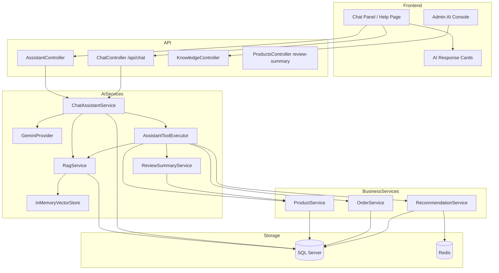

# Corner Store — AI Shopping Assistant Integration Report

## Phase 1 — Project Analysis

### 1. Existing Features

| Area | Status | Details |
|------|--------|---------|
| Frontend | ✅ | Next.js 16 App Router, React 19, Tailwind v4, bilingual EN/AR |
| Backend | ✅ | ASP.NET Core 8 Clean Architecture (.NET 8) |
| Database | ✅ | SQL Server (catalog + orders + AI) + Identity DB + Redis |
| Authentication | ✅ | JWT + ASP.NET Identity (Admin/SuperAdmin roles) |
| Product Management | ✅ | CRUD, brands, types, reviews, images |
| Order Management | ✅ | Create, list, cancel, return, schedule |
| Cart / Wishlist | ✅ | Redis-backed basket + authenticated wishlist |
| Recommendations | ✅ | Trending, similar, personalized, budget, category |
| Payments | ✅ | Stripe + COD + InstaPay |
| Admin Dashboard | ✅ | Commerce, AI, platform monitoring (17+ routes) |
| Chat UI | ✅ | Slide-over assistant panel + `/help` full-page chat |
| AI Assistant | ✅ | Gemini + RAG + tool calling (pre-existing, enhanced) |

### 2. Existing APIs (~80 endpoints)

**Commerce:** `/api/Products`, `/api/Baskets`, `/api/Wishlists`, `/api/Orders`, `/api/Payments`, `/api/Recommendations`

**Auth:** `/api/Authentication/*`, `/api/Account/dashboard`

**AI:** `/api/Assistant/status`, `/api/Assistant/chat`, `/api/chat` (alias), `/api/Knowledge/*`

**Admin:** `/api/Admin/*`, `/api/Admin/ai/*`, `/api/Admin/system/health`

### 3. Existing Database Tables

**Store DB (`ECommerceDBOnline`):**
- `Products`, `ProductBrands`, `ProductTypes`, `Reviews`
- `Order`, `OrderItem`, `DeliveryMethod`
- `KnowledgeDocuments`, `KnowledgeChunks` (embeddings in `EmbeddingJson`)
- `ChatSessions`, `ChatMessages`, `AssistantInteractionLogs`
- `Notifications`, `AuditLogs`, `RecommendationEvents`

**Identity DB:** `Users`, `Addresses`, `Roles`, ASP.NET Identity tables

**Redis:** Baskets (`{basketId}`), Wishlists (`wishlist:{email}`)

### 4. Existing Dashboard Features

- **Commerce:** Products, inventory, orders, users, reviews, reports
- **AI:** Overview, knowledge base, chunks, FAQ, analytics, recommendations, logs, config
- **Platform:** System health, audit logs

### 5. Missing AI Features (Addressed in This Integration)

| Feature | Prior State | Now |
|---------|-------------|-----|
| Review sentiment analysis | Mock UI only | `ReviewSummaryService` + `getReviewSummary` tool |
| Rich product search tool | Keyword + maxPrice only | + category, brand, minPrice |
| Chunk overlap | Fixed-size chunks | 800 chars / 100 overlap |
| AI response cards | Product cards only | Comparison, order status, review summary cards |
| `POST /api/chat` | Only `/api/Assistant/chat` | Both routes available |
| Gemini retries / max tokens | Partial | `MaxRetries`, `MaxTokens` config |
| Automated tests | None | xUnit tests for review + chunking |

### 6. Recommended Integration Points (Used)

- `ChatAssistantService` — orchestration hub
- `AssistantToolExecutor` — business data tools
- `RagService` + `InMemoryVectorStore` — policy/FAQ knowledge
- `assistant-context.tsx` — storefront chat UI
- `admin/ai/*` — AI management console
- Existing `RecommendationService`, `ProductService`, `OrderService`

---

## Architecture Diagram



---

## Database Changes

**No new product/order/customer tables.** AI tables already existed from prior migration `AddAiAssistant`:

| Table | Purpose |
|-------|---------|
| `KnowledgeDocuments` | RAG knowledge content |
| `KnowledgeChunks` | Chunked text + `EmbeddingJson` vector |
| `ChatSessions` | Conversation sessions |
| `ChatMessages` | Message history (role, content, timestamp) |
| `AssistantInteractionLogs` | Analytics + tool usage audit |

Embeddings are stored as JSON on `KnowledgeChunks` (not a separate `Embeddings` table) with in-memory vector search at runtime.

---

## New / Enhanced APIs

| Method | Endpoint | Description |
|--------|----------|-------------|
| POST | `/api/chat` | Alias chat endpoint `{ message, sessionId }` → `{ response, sessionId }` |
| GET | `/api/Products/{id}/review-summary` | Rule-based review sentiment summary |

Existing `/api/Assistant/chat` remains the primary rich endpoint (products + structured cards).

---

## Tool Calling Documentation

Gemini function-calling via `AssistantToolCatalog`. **Never invent business data.**

| Tool | Inputs | Data Source |
|------|--------|-------------|
| `searchProducts` | keyword, category, brand, minPrice, maxPrice | `ProductService` |
| `recommendProducts` | category, maxPrice | `RecommendationService` |
| `compareProducts` | productIds (2–4) | `ProductService` |
| `getSimilarProducts` | productId, count | `RecommendationService` |
| `getOrderStatus` | orderId (optional) | `OrderService` (auth required) |
| `getPersonalizedRecommendations` | — | Cart, wishlist, orders, browsing context |
| `getTrendingProducts` | count | `RecommendationService` |
| `getStorePolicies` | topic | `RagService` |
| `getProductCategories` | — | `ProductService` |
| `getReviewSummary` | productId | `ReviewSummaryService` |

---

## RAG Documentation

**Scope:** Store policies, FAQ, shipping, returns, warranty, payment — **not** products or orders.

**Pipeline:**
1. Admin creates `KnowledgeDocument`
2. `RagService` chunks (800 chars, 100 overlap)
3. `GeminiProvider.GenerateEmbeddingAsync` → stored in `KnowledgeChunks.EmbeddingJson`
4. `InMemoryVectorStore` indexes vectors on startup/reindex
5. User query → embedding search (top 5) → injected into system prompt
6. Keyword fallback if embedding fails

**Admin operations:** Create/edit/delete docs, view chunks, reindex document, reindex all.

---

## Environment Variables

| Variable | Purpose | Default |
|----------|---------|---------|
| `GEMINI_API_KEY` | Google Gemini API key | required |
| `AI__ModelName` | Chat model | `gemini-2.5-flash` |
| `AI__EmbeddingModelName` | Embedding model | `text-embedding-004` |
| `AI__Temperature` | Generation temperature | `0.4` |
| `AI__MaxTokens` | Max output tokens | `2048` |
| `AI__ChunkSize` | RAG chunk size | `800` |
| `AI__ChunkOverlap` | RAG overlap | `100` |
| `AI__TopKRetrieval` | Chunks retrieved | `5` |
| `AI__HistoryLength` | Messages in context | `20` |
| `AI__MaxRetries` | Gemini HTTP retries | `3` |

---

## Safety Rules (System Prompt)

- Never invent products, prices, stock, order status, or policies
- Use tools for all business data
- Use RAG for knowledge/FAQ questions
- State clearly when information is unavailable

---

## Testing Report

### Automated (xUnit)

```
ECommerce.Services.Tests/
├── ReviewSummaryServiceTests.cs  — sentiment classification
└── RagChunkingTests.cs           — chunk overlap
```

Run: `dotnet test CornerStore/backend/ECommerce.Services.Tests`

### Manual Test Scenarios

| Scenario | Example Prompt | Expected |
|----------|----------------|----------|
| Product search | "Show me gaming headphones" | `searchProducts` → product cards |
| Budget recommend | "Recommend a phone under 15000 EGP" | `recommendProducts` with maxPrice |
| Comparison | "Compare product 1 and 2" | Comparison table card |
| Order tracking | "Where is my order?" (signed in) | Order status card |
| Personalized | "Recommend something for me" | Uses cart/recent/wishlist |
| Policy | "What is your return policy?" | RAG + `getStorePolicies` |
| FAQ | "How long is shipping?" | RAG retrieval |
| Review analysis | "What do customers say about product 5?" | Review summary card |
| Memory | Follow-up "tell me more about the first one" | Uses last 20 messages |

---

## Deployment Instructions

1. Set `GEMINI_API_KEY` in `CornerStore/.env` (see `.env.example`)
2. Start stack: `cd CornerStore && docker compose up --build`
3. Verify AI: `GET http://localhost:5141/api/Assistant/status`
4. Open storefront `http://localhost:3848` → click **✦ AI Chat**
5. Admin AI console: `http://localhost:3848/admin/ai` (bootstrap admin on first run)
6. Optional: `AI__EnableStartupIndexing=true` to embed knowledge on startup

---

## Future Enhancement Recommendations

1. **Persistent vector DB** (Qdrant/pgvector) instead of in-memory store
2. **Streaming responses** via SSE for chat panel
3. **True visual search** with Gemini Vision on uploaded images
4. **Intent classification** analytics in admin dashboard
5. **A/B testing** for recommendation algorithms
6. **Multi-language RAG** with Arabic knowledge documents
7. **Rate limiting** per user/session for AI endpoints
8. **Coupon validation** server-side (currently client-only)
